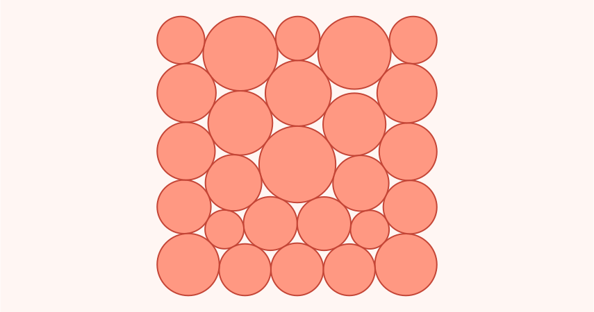

# active-model - results



Cold-start results from a research-discipline framework applied to hard
optimization benchmarks. **The framework itself is in the works and not yet
released.** This repository is organized as a compact result index plus
per-result documents with the details and data files.

## Results

| Problem | This repo's result | Reference | Status | Details |
|---|---:|---:|---|---|
| **n=26 circle packing in unit square** (maximize sum of radii) | sum r = **2.6359830849175889** | 2.6359830822781625 (Aemon) | new SOTA at floating-point precision | [details](n26_circle_packing/README.md) |
| **n=32 circle packing in unit square** (maximize sum of radii) | sum r = 2.939572771 | 2.93957 (Berthold et al., Jan 2026, [arXiv:2601.05943](https://arxiv.org/abs/2601.05943)) | matches Jan-2026 SOTA at floored 5-decimal precision | [details](n32_circle_packing/README.md) |
| **Spherical code / Tammes problem on S^5, N=86** (minimize max pairwise dot) | max dot = **0.548916479201208** | 0.548918184883 (Henry Cohn, [spherical-codes.org](https://spherical-codes.org/), 2026, "needs more optimization") | new best numerical code at verifier precision | [details](spherical_codes/n6_N86/README.md) |
| **Spherical code / Tammes problem on S^5, N=98** (minimize max pairwise dot) | max dot = **0.571037778803683** | 0.571052839653 (Henry Cohn, [spherical-codes.org](https://spherical-codes.org/), 2026, "needs more optimization") | new best numerical code at verifier precision | [details](spherical_codes/n6_N98/README.md) |
| **Lennard-Jones 38-atom cluster** (minimum energy) | U = -173.92842659 | -173.928427 (Cambridge canonical, Gomez/Pillardy/Doye) | matches the canonical global minimum | [details](lennard_jones/lj38/README.md) |
| **Lennard-Jones 75-atom cluster** (minimum energy) | U = -396.282 (icosahedral local minimum) | -397.492331 (Marks decahedral global) | local minimum only; does not reach the global | [details](lennard_jones/lj75/README.md) |

## Verification

Each result folder contains the candidate data that is available for that
problem, the relevant reference value, and any result-specific caveats.

For the n=26 circle-packing result, the repository includes a local strict
checker:

```bash
python n26_circle_packing/verify.py n26_circle_packing/best_26_circles.json
```

The Tammes/spherical-code entry includes the coordinate file and the captured
verification report from the experiment run; no separate Tammes verifier is
included in this public repository.

## Framework

The methodology - a generic research-discipline scaffold applied unchanged
across these problems, the operating rules, and the per-run trace files showing
what the agent tried - is in the works and will be released separately.

## License

MIT - see `LICENSE`. Citation requested as a courtesy (see `CITATION.cff`), not
as a license condition.

## How to cite

```text
Kovacic, M. (2026). Active Model: cold-start results on circle packing,
spherical codes, and Lennard-Jones cluster minimization.
https://github.com/matevz-kovacic/active-model
```
