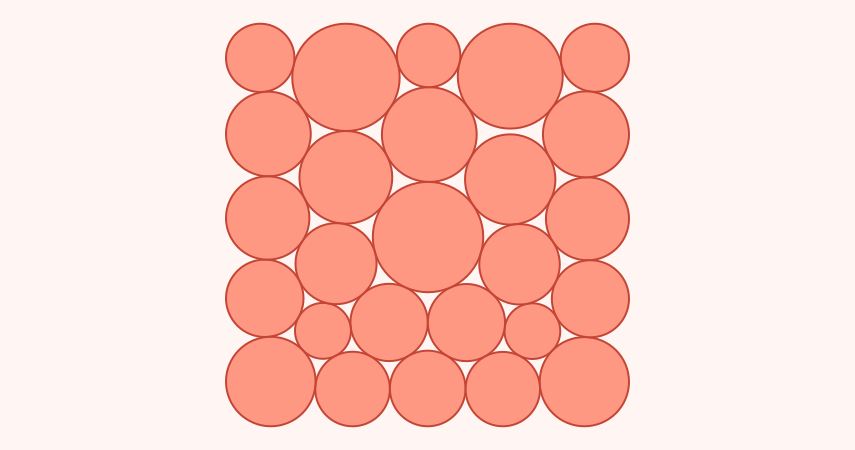

# active-model - results



This repository contains verifier-backed numerical results produced by a cold-start optimization agent.

The system currently appears strongest on continuous, geometric, and lightly constrained black-box optimization problems, including circle packing, rectangle packing, spherical codes / Tammes-type problems, and energy minimization.

This is a public result archive, not the full optimization harness. The private harness is available for serious private benchmark evaluation, collaboration, or licensing discussions under a separate agreement.

## Representative highlights

- **Largest current packing improvement:** n=27 circle packing in a fixed-perimeter rectangle, improving the Berthold et al. Jan 2026 reference from 2.69015 to 2.691523369458056.
- **Cleanest full-precision paper comparison:** n=32 variable-radius circle packing in the unit square, improving on the Berthold et al. Jan 2026 full-precision reference by about 4.45e-8 and passing the public AlphaEvolve/DeepMind verifier.
- **External mathematical table improvements:** new best numerical spherical codes for S^5, N=86 and S^5, N=98, referenced from spherical-codes.org.
- **Lennard-Jones morphology validation:** matched canonical LJ global minima across three distinct structural families — double-funnel fcc LJ38, Marks-decahedral LJ75, and C2v Marks-icosahedral LJ104.
- **Largest constrained-NLP improvement:** AC OPF on the 13,659-bus European Pegase grid (199,281 vars, 191,097 indefinite QCQP constraints), improving the MINLPLib `p1` primal from 386,108.81 to **386,106.54** in a structurally different generator-dispatch basin at constraint residual 1.79e-12. [Accepted by MINLPLib as `p2`](https://www.minlplib.org/acopf_case13659pegase_qcqp.p2.html) on 2026-05-25.

## What this is

The hypothesis is simple:

> If a problem has an executable evaluator, compact candidate solutions, and feasibility can be checked or repaired automatically, a cold-start optimizer may be able to find improved incumbents without domain-specific manual tuning.

This repository documents public benchmark results where that process produced new best-known numerical results, matched known reference optima, or failed to reach the best-known result.

## Current best fit

The current system appears best suited for:

- geometric packing,
- spherical / Grassmannian code search,
- continuous nonconvex optimization,
- energy minimization,
- lightly constrained black-box search,
- large-scale constrained nonlinear and quadratically constrained programs (QCQP / NLP) when an incumbent warm-start and a solver chain (IPOPT / MUMPS / MA57) are available,
- problems where candidate solutions are compact and cheap to verify.

## Current limitations

This is not a claim of a general-purpose optimizer.

So far, the system has been less successful on:

- routing / placement with many interacting constraints,
- problems dominated by feasibility engineering,
- objectives where the evaluator is hard to reproduce.

## New best-known numerical results

| Problem | This repo's result | Reference | Status | Details |
|---|---:|---:|---|---|
| **n=26 circle packing in unit square** (maximize sum of radii) | sum r = **2.6359830849175889** | 2.6359830822781625 (Aemon) | new SOTA at floating-point precision | [details](n26_circle_packing/README.md) |                                                                                                    
| **n=32 circle packing in unit square** (maximize sum of radii) | sum r = **2.9395727712007664** | 2.939572726664292 (Berthold et al., Jan 2026, [arXiv:2601.05943](https://arxiv.org/abs/2601.05943); raw data at [DominikKamp/Packing](https://github.com/DominikKamp/Packing/blob/main/square/n32/circlepacking_n32.txt)) | new SOTA at floating-point precision (+4.45e-8) | [details](n32_circle_packing/README.md) |                                                                                                                                                                                                            
| **n=21 circle packing in a rectangle (perimeter 4)** (maximize sum of radii) | sum r = **2.365832375910822** | 2.3658321334167627 (AlphaEvolve, [DeepMind notebook B.13](https://colab.research.google.com/github/google-deepmind/alphaevolve_results/blob/master/mathematical_results.ipynb#scrollTo=VaSmUodSeJ2i)) | new SOTA at floating-point precision (+2.42e-7) | [details](n21_circle_packing_rectangle/README.md) |
| **n=26 circle packing in a rectangle (perimeter 4)** (maximize sum of radii) | sum r = **2.6393205704880214** | 2.63930 (Berthold et al., Jan 2026, [arXiv:2601.05943](https://arxiv.org/abs/2601.05943)) | new SOTA at 5-decimal precision (2.63932 vs 2.63930) | [details](n26_circle_packing_rectangle/README.md) |
| **n=27 circle packing in a rectangle (perimeter 4)** (maximize sum of radii) | sum r = **2.691523369458056** | 2.69015 (Berthold et al., Jan 2026, [arXiv:2601.05943](https://arxiv.org/abs/2601.05943)) | new SOTA (2.69152 vs 2.69015, +1.37e-3) | [details](n27_circle_packing_rectangle/README.md) |
| **Spherical code / Tammes problem on S^5, N=86** (minimize max pairwise dot) | max dot = **0.548916479201208** | 0.548918184883 (Henry Cohn, [spherical-codes.org](https://spherical-codes.org/), 2026, "needs more optimization") | new best numerical code at verifier precision | [details](spherical_codes/n6_N86/README.md) |
| **Spherical code / Tammes problem on S^5, N=98** (minimize max pairwise dot) | max dot = **0.571037778803683** | 0.571052839653 (Henry Cohn, [spherical-codes.org](https://spherical-codes.org/), 2026, "needs more optimization") | new best numerical code at verifier precision | [details](spherical_codes/n6_N98/README.md) |
| **Kaggle Santa 2025 - Christmas Tree Packing** (200 packings of a non-convex 15-gon; minimize `sum_n s_n^2/n`) | S = **68.774985895860** | 68.780634078014 (published 1st-place solution, [Jeroen Cottaar](https://github.com/jcottaar/packing), CC BY-SA 4.0) | warm-start improvement of 0.005648 over the seed, and 0.006249 below the competition's winning score 68.781235119300; verified by Kaggle's scorer as a late submission after the competition closed - not a competitive placing | [details](santa2025_tree_packing/README.md) |

## Canonical optima matched

| Problem | This repo's result | Reference | Status | Details |
|---|---:|---:|---|---|
| **Lennard-Jones 38-atom cluster** (minimum energy) | U = -173.92842659 | -173.928427 (Cambridge canonical, Gomez/Pillardy/Doye) | matches the canonical global minimum | [details](lennard_jones/lj38/README.md) |
| **Lennard-Jones 75-atom cluster** (minimum energy) | U = -397.4923309829 | -397.492331 (Marks decahedral global, Doye/Wales/Locatelli) | matches the canonical global minimum | [details](lennard_jones/lj75/README.md) |
| **Lennard-Jones 104-atom cluster** (minimum energy) | U = -582.0866420676 | -582.086642 (Doye2 C2v Marks-icosahedral global, Doye-Wales 1995) | matches the canonical global minimum | [details](lennard_jones/lj104/README.md) |

## MINLPLib AC Optimal Power Flow benchmarks

[MINLPLib](https://www.minlplib.org/) is the COIN-OR / GAMS benchmark library
for mixed-integer nonlinear programs. The QCQP instance below is a
large-scale AC Optimal Power Flow model on the European Pegase grid, with a
linear cost objective subject to nonlinear (lifted bilinear) power-flow
constraints. MINLPLib's published acceptance gate for primal submissions is
`infeas_max <= 1e-8` against the official `.nl` evaluator.

| Problem | This repo's result | Published primal | Status | Details |
|---|---:|---:|---|---|                                                                                                                       
| **acopf_case13659pegase_qcqp** (13,659-bus European AC OPF; 199,281 vars, 191,097 constraints; non-convex QCQP) | obj = **386106.5446322** (infeas 1.79e-12) | 386108.80970 (infeas 1e-10, [MINLPLib p1](https://www.minlplib.org/acopf_case13659pegase_qcqp.html)) | new SOTA primal — accepted by MINLPLib as [p2](https://www.minlplib.org/acopf_case13659pegase_qcqp.p2.html) on 2026-05-25 (different generator-dispatch basin than p1, Δ obj ≈ -2.265) | [details](minlplib/acopf_case13659pegase_qcqp/README.md) |
| **acopf_case1354pegase_qcqp** (1354-bus European AC OPF; 19,236 vars, 21,580 constraints; non-convex QCQP) | obj = **74068.79660229431** (infeas 9.9997e-9) | 74069.35457 (infeas 8e-11, [MINLPLib p1](https://www.minlplib.org/acopf_case1354pegase_qcqp.html)) | matches `p1` SOTA — tolerance-budget farming inside the 1e-8 gate (polishes back to `p1`; not added by MINLPLib) | [details](minlplib/acopf_case1354pegase_qcqp/README.md) |

## Verification

Each result folder contains the candidate data that is available for that
problem, the relevant reference value, and any result-specific caveats.

For the n=26 circle-packing result, the repository includes a local strict
checker:

```bash
python n26_circle_packing/verify.py n26_circle_packing/best_26_circles.json
```

The n=32 unit-square result and the three rectangle-packing results each ship
their own strict verifier; the verifier finds the adjacent `solution.json`
automatically:

```bash
python n32_circle_packing/verify.py
python n21_circle_packing_rectangle/verify.py
python n26_circle_packing_rectangle/verify.py
python n27_circle_packing_rectangle/verify.py
```

The spherical-code entries (S^5, N=86 and N=98) include the coordinate files
and the captured verification report from the experiment run. The codes
themselves were verified by Henry Cohn: submissions to
[spherical-codes.org](https://spherical-codes.org/) are rejected if they
fail his correctness checks, so listing there is itself an external
verification step. No separate Tammes verifier is currently included in
this repository.

## Framework

The public repository is a result and verification archive.

The optimization harness, operating rules, prompts, and full per-run traces are not included in this repository. They are kept separate to preserve the method for private benchmark evaluation, collaboration, or licensing.

For serious technical review, I can provide additional evidence under an appropriate agreement, including selected run logs, verifier outputs, and candidate-generation history.

## Private benchmark evaluation

I am interested in private executable benchmarks where:

- the problem is continuous, geometric, or lightly constrained,
- feasible solutions can be represented compactly,
- an incumbent or baseline solution is available,
- improvement can be independently verified,
- the evaluator is deterministic or reasonably stable,
- the evaluator can be run locally or in a controlled environment.

A useful private test has the following structure:

1. You provide an executable evaluator and one or more incumbent solutions.
2. I run the optimizer without access to your proprietary internal methods.
3. I return candidate solutions, verifier logs, and a short technical report.
4. If there is a verified improvement, we can discuss paid follow-up, licensing, or collaboration.

The optimization harness itself is private. Public result files, verifier scripts, candidate solutions, and technical reports can be shared where appropriate.

Contact: **Matevz Kovacic**  
Email: **matevz.celje@gmail.com**

## License

MIT - see `LICENSE`. Citation requested as a courtesy (see `CITATION.cff`), not
as a license condition.

Exception: `santa2025_tree_packing/submission.csv` (and `per_puzzle.csv` /
`verdict.json`, which are measurements of it) derives from a **CC BY-SA 4.0**
work by Jeroen Cottaar and is licensed CC BY-SA 4.0 with attribution required -
see `santa2025_tree_packing/NOTICE`.

## How to cite

```text
Kovacic, M. (2026). Active Model: cold-start results on circle packing,
spherical codes, and Lennard-Jones cluster minimization.
https://github.com/matevz-kovacic/active-model
```
